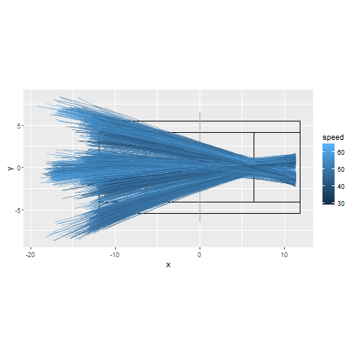
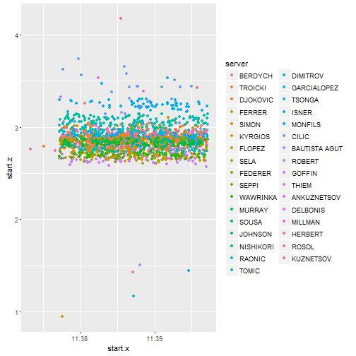

<style>
.midcenter {
    position: fixed;
    top: 50%;
    left: 50%;
}
</style>


Visualizing Serve Trajectories in High-Performance Tennis with R
=================================
author: Alwin  Wang
date: 18th July 2016
font-family: 'Helvetica'
transition: rotate
transition-speed: slow
#incremental: true

Impact Image
========================================================
title: false

```
[1] "atp serve data loaded"
[1] "generate organised data functions loaded"
```




Initial Analysis
========================================================
type: section

Features of a Tennis serve
========================================================
incremental:true
There are serveral interesting features in serves that should be visualised to describe a tennis serve
- Position of the ball in time
- Curvature of the ball
- Speed of the ball
- Displaying multiple serves
- Serve clusters
- Accessible visualisations
incremental:false

Identification of Outliers
========================================================


Plots in 3D
========================================================
<!--html_preserve--><div id="htmlwidget-7878" style="width:504px;height:504px;" class="plotly html-widget"></div>
<script type="application/json" data-for="htmlwidget-7878">{"x":{"data":[{"type":"scatter3d","inherit":false,"x":[11.3909554160798,9.28272461298879,7.25393596277921,5.30458946545104,3.43468512100429,1.64422292943895,-0.0667971092449875,-1.6983749950475,-3.25051072796862,-4.72320430800833,-4.80681704662803,-5.89479928363219,-6.95769402915844,-7.99550128320676,-9.00822104577716,-9.99585331686965,-10.9583980964842,-11.8958553846208,-12.8082251812796,-13.6955074864604],"y":[0.949315495386109,0.762687815887112,0.581770806767718,0.406564468027923,0.237068799667731,0.0732838016871402,-0.0847905259138493,-0.237154183135239,-0.383807169977025,-0.524749486439209,-0.5328061570661,-0.636504518504039,-0.740695450380012,-0.845378952694019,-0.95055502544606,-1.05622366863614,-1.16238488226425,-1.26903866633039,-1.37618502083457,-1.48382394577678],"z":[3.04533601966951,2.67258295845873,2.30934216200426,1.95561363030612,1.61139736336429,1.27669336117878,0.951501623749594,0.635822151076722,0.329654943160173,0.0329999999999373,0.0329999999999835,0.260236070876775,0.462249329782487,0.639039776717137,0.79060741168071,0.916952234673225,1.01807424569465,1.09397344474502,1.14464983182433,1.17010340693255],"mode":"lines","group":["1_01_03_1_194206.trj","1_01_03_1_194206.trj","1_01_03_1_194206.trj","1_01_03_1_194206.trj","1_01_03_1_194206.trj","1_01_03_1_194206.trj","1_01_03_1_194206.trj","1_01_03_1_194206.trj","1_01_03_1_194206.trj","1_01_03_1_194206.trj","1_01_03_1_194206.trj","1_01_03_1_194206.trj","1_01_03_1_194206.trj","1_01_03_1_194206.trj","1_01_03_1_194206.trj","1_01_03_1_194206.trj","1_01_03_1_194206.trj","1_01_03_1_194206.trj","1_01_03_1_194206.trj","1_01_03_1_194206.trj"],"name":"1_01_03_1_194206.trj"},{"x":[-11.89,-11.89,0,0,0,0,0,0,11.89,11.89,-11.89,-11.89,11.89,11.89,-11.89,-6.4,-6.4,6.4,6.4,6.4,-6.4],"y":[5.49,-5.49,-5.49,-6.5,-6.5,6.5,6.5,-5.49,-5.49,5.49,5.49,4.115,4.115,-4.115,-4.115,-4.115,4.115,4.115,-4.115,0,0],"z":[0,0,0,0,1.09,1.09,0,0,0,0,0,0,0,0,0,0,0,0,0,0,0],"type":"scatter3d","mode":"lines"}],"layout":{"scene":{"aspectmode":"data","xaxis":{"title":"pos.x"},"yaxis":{"title":"pos.y"},"zaxis":{"title":"pos.z"}},"margin":{"b":40,"l":60,"t":25,"r":10}},"url":null,"width":null,"height":null,"source":"A","config":{"modeBarButtonsToRemove":["sendDataToCloud"]},"base_url":"https://plot.ly"},"evals":[],"jsHooks":[]}</script><!--/html_preserve-->

Slide With Plot
========================================================

```r
plot(cars)
```


