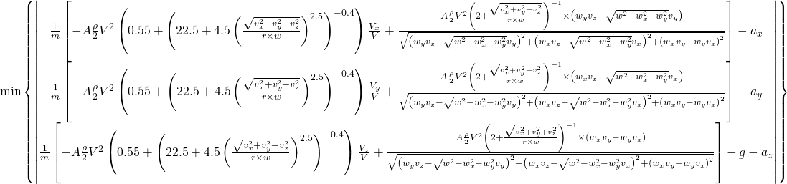

```{r setup, include=FALSE}
knitr::opts_chunk$set(
  echo = FALSE, 
  messages = FALSE, 
  warning = FALSE,
  cache = TRUE,
  fig.align = "center")
```

```{r packages, cache = FALSE, include = FALSE}
#--- Packages Required
library(knitr)
library(MASS)
library(cowplot)
library(lazyeval)
library(tidyr)
library(dplyr)
library(purrr)
library(broom)
library(ggplot2)
library(plotly)
library(hextri)
library(hexbin)
library(RColorBrewer)
library(aplpack)
```

```{r scripts, cache = FALSE}
#--- Load functions from helper scripts
source("Helper Load Data.R")
source("Helper Plotting Factors.R")
source("Helper Standardise Coefficients.R")
source("Helper Plotting Values.R")
source("Helper Spin Coefficients.R")
source("Helper Basic Plots.R")
source("Helper Contour Limits.R")
source("Helper Heat Map.R")
```

```{r generatedata, eval = TRUE}
#--- Generate the data for plotting
data <- PlottingFactors(atp_serves)
coef.df <- StandardiseCoefficients(data,matchid,server,speedkmph,speed_class,serve_num,serve_classname,side,scorername,
                                   start.x, start.y, start.z, center.x, center.y,
                                   height_off_bounce, angle.change, importance)
values <- PlottingValues(coef.df,tstep = 0.04)
resultstidy <-  SpinModel(values)
```

```{r tidydata, eval = TRUE}
serve_outliers <- data.frame(serveid = c(
    "1_09_02_1_191947.trj", "2_04_01_1_172646.trj", "2_06_02_1_214102.trj",
    "3_01_03_2_181341.trj", "3_04_03_1_205313.trj", "3_06_08_2_174140.trj",
    "4_02_02_1_180400.trj", "4_03_05_1_190717.trj", "4_05_01_1_213913.trj",
    "1_02_01_1_161204.trj"))
# Filter out outliers
plot_sample <- resultstidy %>% 
    filter(!(serveid %in% serve_outliers$serveid))
# Data per serve
plot_perserve <- plot_sample  %>% 
    select(-(t:a), -(ax_p:az_p)) %>%
    group_by(serveid, arc) %>%
    mutate(Cd_ave = mean(Cd), Cl_ave = mean(Cl)) %>%
    distinct(.keep_all = TRUE) %>%
    gather(key, value, -(1:(match("arc", colnames(.))))) %>%
    unite(key, c(key,arc), sep="_arc") %>%
    spread(key, value) %>%
    distinct(.keep_all = TRUE)
#--- Select players with multiple games
MultipleGames <- function(min, perserve=FALSE, server=FALSE) {
    multiple_games <- atp_serves %>% 
        select(server, matchid) %>% distinct() %>% 
        count(server, sort=TRUE) %>% filter(n >= min)
    if (perserve==FALSE) {
    plot_sample %>%
        filter(server %in% multiple_games$server)
    }
    else {
      if (server==FALSE) {
      plot_perserve %>%
        filter(server %in% multiple_games$server)
      }
      else {
        as.data.frame(multiple_games %>% select(server))
      }
    }
}
```

```{r savedata, eval = TRUE}
save(data, coef.df, values, resultstidy, serve_outliers, plot_sample, plot_perserve, MultipleGames,
     file = "knitrdata.RData")
```

```{r loaddata, eval = FALSE}
load("knitrdata.RData")
```


# The Goal

## Realistic Summaries
 - Summaries of serve trajectories that can be interpreted by TV audiences
 - Summaries that can be utilised by researches for visualising serve data

## Key Characteristics
 - Position ($t$, $x$, $y$ ,$z$)
 - Speed ($v_{initial}$, changes in $v$ due to the surface)
 - Spin (side spin, top spin)
 - Strategy (single serves, serve clusters)

# Background

## Current Methods {.flexbox .vcenter}
```{r bk_all_path, fig.cap = "All serve paths as overlayed lines"}
plot_gg <- as.data.frame(plot_sample)
court_topdown + 
  geom_path(aes(x=px, y=py, group=serveid, colour=server), data=plot_gg, alpha = 0.5) +  
  theme(legend.key.size = unit(0.3, "cm"))
```

## Current Methods {.flexbox .vcenter}
```{r bk_all_land, fig.cap = "Landing positions of all serves"}
plot_gg <- as.data.frame(plot_perserve)
court_service + 
  geom_point(aes(x=center.x, y=center.y, group=serveid, colour=server), data=plot_gg, alpha = 0.5) +  
  theme(legend.key.size = unit(0.3, "cm"))
```

## Current Methods {.flexbox .vcenter}
```{r bk_all_land_ace, fig.cap = "Landing positions of aces"}
plot_gg <- as.data.frame(plot_perserve)
court_service + 
  geom_point(aes(x=center.x, y=center.y, group=serveid, 
                 colour=factor(ifelse(serve_classname == "Ace", "Yes", "No")),
                 alpha=factor(ifelse(serve_classname == "Ace", "Yes", "No"))),
             data=plot_gg) +  
  scale_colour_manual(name = "Ace", breaks = c("Yes", "No"), values = c("Yes" = "red", "No" = "grey")) + 
  scale_alpha_manual(guide = "none", values = c("Yes" = 1, "No" = 0.2))
```

## Visualising Higher Dimensional Data | Bad Method
```{r bk_chernoff, fig.cap = "Chernoff faces"}
plot_gg <- data %>%
  filter(server %in% c("RAONIC", "MURRAY")) %>%
  sample_n(25)
plot_gg <- as.data.frame(plot_gg[c(
  "server", "speedkmph", "start.x", "start.y", "start.z", "center.x", "center.y", "height_off_bounce", "y0.1", "net.clearance",
  "duration.arc1"
  )])
facesout <- capture.output(faces(plot_gg[,2:ncol(plot_gg)], labels=plot_gg[,1], face.type = 1))
```


## Visualising Higher Dimensional Data | Less Bad Method
```{r bk_parcoord, fig.cap = "Parallel Coordinates"}
plot_gg <- as.data.frame(data[1:300, c(
  "server", "serve.x", "speedkmph", "center.y", "net.clearance", "height_off_bounce", "duration.arc1", "y0.1", "y1.1", "z0.1", "z1.1"
  )])
plot_gg <- arrange(plot_gg, -speedkmph) %>% mutate(serve.x = -serve.x)
parcoordlabel(plot_gg[,2:ncol(plot_gg)], col=rainbow(nrow(plot_gg)))
```

# Shape

## Hexagonal Binnning {.flexbox .vcenter}
```{r shape_speed, fig.cap = "Average impact speed in hexagonal bins"}
plot_gg <- plot_sample
court_topdown + 
    stat_summary_hex(data = plot_gg, aes(x=px, y=py, z=speedkmph), bins = 45, 
                fun = function(z) mean(z),
                colour = "white", alpha = 0.7) +
    scale_fill_gradientn(colours = brewer.pal(9, "YlOrBr"), 
                         guide = "colourbar",
                         name = "Average \nimpact \nspeed \n(km/h)")
```

## Hexagonal Binnning {.flexbox .vcenter}
```{r shape_spin, fig.cap = "Average estimated rotational speed in hexagonal bins"}
plot_gg <- filter(plot_sample, w_rpm < 6000)
court_topdown + 
    stat_summary_hex(data = plot_gg, aes(x=px, y=py, z=w_rpm), bins = 45, 
                fun = function(z) mean(z),
                colour = "white", alpha = 0.7) +
    scale_fill_gradientn(colours = brewer.pal(9, "YlOrBr"), 
                         guide = "colourbar",
                         name = "Average \nestimated \nrotation \nspeed \n(RPM)")
```

## Hexagonal Binnning {.flexbox .vcenter}
```{r shape_class, fig.cap = "Serve type using Hextri"}
plot_gg <- filter(plot_sample, serve_classname != "Fault")
hextri(x=plot_gg$px, y=plot_gg$py,
       class=plot_gg$serve_classname, 
       colours=c("blue","orange","green", "red"), nbins = 30, border=TRUE,style="size")
    lines(x=court_trace$x, y=court_trace$y, lwd = 2)
    legend(3,9,fill=c("blue","green","orange"),
       legend=c("Ace", "Not Returned", "Returned"),bty="n")
```

## Interpretation {.flexbox .vcenter}
Is it even necessary to show the entire path?

## Split Path with Landing Positions
```{r shape_split_dot, fig.cap = "Split landing position coloured by serve number"}
plot_arc1 <- plot_sample %>% 
  filter(arc == 1) %>% group_by(serveid) %>%
  top_n(4,-t) %>% top_n(3,t)
plot_arc3 <- plot_sample %>% 
  filter(arc == 3) %>% group_by(serveid) %>%
  top_n(4,-t) %>% top_n(2,t)
plot_gg <- plot_perserve

#--- Plot
court_topdown + 
  geom_point(data = filter(plot_gg, serve_classname != "Fault"), aes(x=center.x, y=center.y, colour = serve_num), alpha=0.5) +
  geom_path(data = filter(plot_arc1, serve_classname != "Fault"), aes(x=px,y=py, group=serveid, colour = serve_num), alpha = 0.8) +
  geom_path(data = filter(plot_arc3, serve_classname != "Fault"), aes(x=px,y=py, group=serveid, colour = serve_num), alpha = 0.8) +
  guides(colour = guide_legend(override.aes = list(shape = 19, alpha = 1))) +
  scale_colour_discrete(name = "Serve Number") + 
  theme(legend.key=element_rect(fill=NA))
```

## Murray and Raonic
```{r shape_split_dot_servers, fig.cap = "Split landing position coloured by serve number"}
plot_arc3 <- filter(plot_sample, server %in% c("RAONIC", "MURRAY")) %>% 
  filter(arc == 3) %>% group_by(serveid) %>%
  top_n(4,-t) %>% top_n(2,t)
plot_gg <- filter(plot_perserve, server %in% c("RAONIC", "MURRAY"))

#--- Plot
court_service + 
  geom_point(data = filter(plot_gg, serve_classname != "Fault"), aes(x=center.x, y=center.y, colour = serve_num), alpha=0.5) +
  geom_path(data = filter(plot_arc3, serve_classname != "Fault"), aes(x=px,y=py, group=serveid, colour = serve_num), alpha = 0.8) +
  facet_wrap(~server) + 
  guides(colour = guide_legend(override.aes = list(shape = 19, alpha = 1))) +
  scale_colour_discrete(name = "Serve Number")  + 
  theme(legend.key=element_rect(fill=NA))
```

## Comparison of Contour Plots
```{r shape_contour_comparison, fig.cap = "Effect of limits on contour plots"}
#--- Plotting uing geom_density2d from ggplot2
plot_gg <- plot_perserve %>% filter(serve_classname != "Fault")
plot1 <- court_service + 
    geom_density2d(data = plot_gg, aes(x=center.x, y=center.y))
#--- Plotting using Two Dimensional Kernel Density Estimation from MASS 
#    (axis-aligned bivariate normal kernel on a square grid)
plot_Ad <- plot_perserve %>% filter(side == "Ad")
densAd <- kde2d(plot_Ad$center.x, plot_Ad$center.y, 
              lims = c(-6.4, 0, 0, 4.115))
plot_Ad <- data.frame(expand.grid(center.x = densAd$x, center.y = densAd$y),
                     z = as.vector(densAd$z)) %>%
              mutate(side = "Ad")
plot_Du <- plot_perserve %>% filter(side == "Deuce")
densDu <- kde2d(plot_Du$center.x, plot_Du$center.y, 
              lims = c(-6.4, 0, -4.115, 0))
plot_Du <- data.frame(expand.grid(center.x = densDu$x, center.y = densDu$y),
                     z = as.vector(densDu$z)) %>%
              mutate(side = "Deuce")
plot2 <- court_service + 
  geom_contour(aes(x=center.x, y=center.y,z=z), data = plot_Ad) +
  geom_contour(aes(x=center.x, y=center.y,z=z), data = plot_Du)
#--- plot the results side by side
plot_grid(plot1, plot2, align='h', labels=c('Gauss (default)', 'KDE2D (hacked)'))
```

## Comparison of Different Players
```{r shape_contour_top_players, fig.cap="Players who've played at least 3 games"}
plotall <-  ContourLimits(plot_perserve, argument1 = "serve_num", min_games = 3, plot = FALSE)
plotall + facet_grid(serve_num ~ server) + theme_court
```

## Comparison of Top and Bottom Players
```{r shape_contour_top_v_bottom, fig.cap="Comparison of top ranked (1, 2, 3, 4) and bottom ranked (87, 95, 167, 225) in the sample"}
servers <- data.frame(servers = c("DJOKOVIC", "MURRAY", "FEDERER", "WAWRINKA"))
plot1 <- ContourLimits(plot_perserve, "serve_num", servers, plot = TRUE) + theme_court
servers <- data.frame(servers = c("SELA", "MILLMAN", "HERBERT", "ROBERT"))
plot2 <- ContourLimits(plot_perserve, "serve_num", servers, plot = TRUE) + theme_court

plot_grid(plot1, plot2, align='h', 
          labels=c('Top', 'Bottom'))
```

# Speed

## Speed and Landing Position
```{r speed_all_land, fig.cap = "Landing positions of all serves coloured by speed"}
plot_gg <- as.data.frame(plot_perserve)
court_service + 
  geom_point(aes(x=center.x, y=center.y, group=serveid, colour=speedkmph), data=plot_gg, alpha = 0.5) +  
  theme(legend.key.size = unit(0.3, "cm"))
```

## Speed and Importance
```{r speed_importance}
plot_gg <- filter(plot_perserve, server %in% c("FEDERER", "RAONIC") )
court_service +
  geom_point(aes(x = center.x, y = center.y, colour = importance),
             data = plot_gg) + 
  scale_colour_gradientn(colours = brewer.pal(7, "Oranges"), 
                         guide = "colourbar",
                         name = "Importance") +
  facet_grid(~server)
```

## Novak
```{r speed_allsidenumspeedy_novak}
plot_gg <- plot_perserve %>% filter(server == "DJOKOVIC")
ggplot(data = plot_gg, aes(start.y, fill=speed_class)) + 
   geom_density(alpha = 0.2) + 
   facet_grid(serve_num ~ side, scales = "free")
```

## Kyrgios
```{r speed_allsidenumspeedy_kyrgios}
plot_gg <- plot_perserve %>% filter(server == "KYRGIOS")
ggplot(data = plot_gg, aes(start.y, fill=speed_class)) + 
   geom_density(alpha = 0.2) + 
   facet_grid(serve_num ~ side, scales = "free")
```


# Spin

## Importance of Spin
```{r spin_importance, fig.cap="Importance of spin"}
serve_coolarc <- c("5_02_02_1_190119.trj","3_01_02_1_171036.trj")
plot_gg <- plot_sample %>% filter(serveid %in% serve_coolarc)
court_behind + geom_path(aes(x=py,y=pz, group=serveid, colour = server), data=plot_gg, alpha = 1) + 
    geom_path(data = net_trace, aes(x = y, y = z), color = 'blue', size = 1.0)
```


## Spin Model |Just a simple matter of...
```{r RMS_vec_image, out.width = "900px"}

```

## Spin Model Overview {.flexbox .vcenter .smaller}
$$\text{Prediction:}\qquad\vec{a}_{\text{p}}=\frac{\vec{F}_{\text{net}}}{m}=\frac{\vec{L}}{m}+\frac{\vec{D}}{m}+\vec{g} \\
\text{Lift Force:}\qquad\vec{L}=\left|L\right|\cdot\frac{\vec{W}\times\vec{V}}{\left|\vec{W}\times\vec{V}\right|}\qquad\left|L\right|=A\frac{\rho}{2}V^{2}\left(\frac{1}{2+\frac{V}{V_{s}}}\right) \\
\text{Drag Force:}\qquad\vec{D}=-\left|D\right|\cdot\frac{\vec{V}}{\left|V\right|}\quad\left|D\right|=A\frac{\rho}{2}V^{2}\left(0.55+\frac{1}{\left(22.5+4.5\left(\frac{V}{V_{S}}\right)^{2.5}\right)^{0.4}}\right)$$

## Spin Model Overview {.flexbox .vcenter}
$$\vec{W}=w_{x}\vec{i}+w_{y}\vec{j}+\sqrt{w^{2}-w_{x}^{2}-w_{y}^{2}}\,\vec{k} \\
\text{from} \\ 
\vec{a}=a_{x}\vec{i}+a_{y}\vec{j}+a_{z}\vec{k} \quad \text{and} \quad \vec{v}=a_{x}\vec{i}+v_{y}\vec{j}+v_{z}\vec{k}$$

## Spin vs Speed {.flexbox .vcenter .smaller}
```{r spin_spin_v_speed}
plot_gg <- filter(plot_perserve, w_rpm_arc1<6000)
ggplot(plot_gg) + 
  geom_point(aes(x = w_rpm_arc1, y = speedkmph, colour = (center.y)), alpha = 0.8) +
  facet_wrap(~serve_num) + 
  scale_colour_gradientn(colours = brewer.pal(9, "RdYlBu"), 
                         guide = "colourbar",
                         name = "Distance \nfrom \ncenterline")
```

## Speed and Spin of Top Players {.flexbox .vcenter .smaller}
```{r spin_speedspin_top}
plot_multiple_games <- MultipleGames(4)
plot_gg <- plot_perserve %>% filter(server %in% plot_multiple_games$server,
                                    w_rpm_arc1 < 5500)
plot1 <- ggplot(plot_gg, aes(w_rpm_arc1, colour=serve_num)) + 
  geom_density() + 
  facet_grid(server ~ side, scales = "free_y") +
  guides(colour=FALSE)
plot2 <-ggplot(plot_gg, aes(speedkmph, colour=serve_num)) + 
  geom_density() + 
  facet_grid(server ~ side, scales = "free_y")

plot_grid(plot1, plot2, align='h', ncol=2,
          labels=c('Spin', 'Speed'))
```

## Federer and Raonic {.flexbox .vcenter .smaller}
```{r spin_fe_rao}
plot_gg <- filter(plot_perserve, w_rpm_arc1<4000, server %in% c("FEDERER", "RAONIC"))
ggplot(plot_gg) + 
  geom_point(aes(x = w_rpm_arc1, y = speedkmph, colour = (center.y)), alpha = 1) +
  facet_grid(server~serve_num) + 
  scale_colour_gradientn(colours = brewer.pal(11, "RdYlBu"), 
                         guide = "colourbar",
                         name = "Distance \nfrom \ncenterline")
```

# Putting it all together
## Master visualisation (no 3D)
 - contour on court
 - lines leading away
 - lines coloured by spin

# Thank you

# Appendix

##

```{r, spin_axis_end_point}
plot_gg <- filter(plot_perserve, w_rpm_arc1<4500, scorername != "No Winner")
ggplot(plot_gg) + 
  geom_point(aes(x = wx_arc1, y = wy_arc1, colour = wz_arc1, size = w_rpm_arc1, shape = scorername)) + 
  facet_grid(serve_num ~ side)
```


